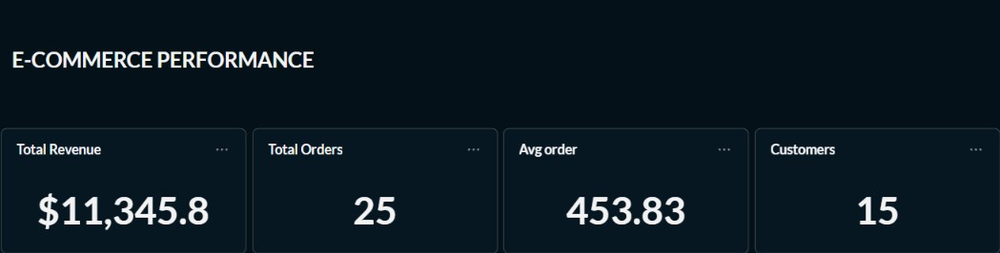
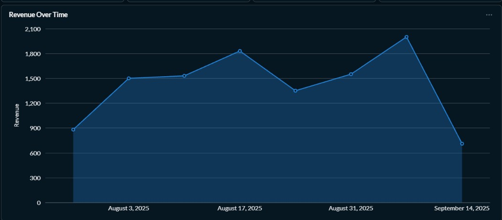
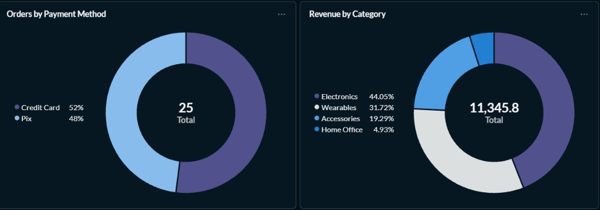
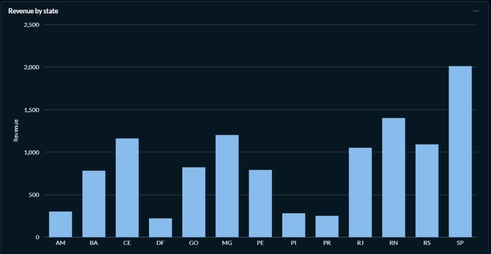
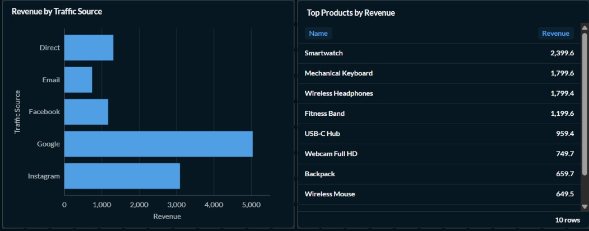

# 📊 E-commerce Performance Dashboard

An analytics dashboard for a Brazilian e-commerce store, built on top of a **MySQL** database and run with **Docker Compose**. It brings together the key sales indicators in a single view: revenue, orders, average order value, customers, payment methods, categories, products, traffic sources, and geographic distribution by state.

---

## 📑 Table of Contents

1. [Overview](#-overview)
2. [Project Structure](#-project-structure)
3. [Tech Stack](#-tech-stack)
4. [Getting Started](#-getting-started)
5. [Dashboard Panels](#-dashboard-panels)
6. [Key Insights](#-key-insights)


---

##  Overview

The dashboard is designed to answer common business questions quickly:

- How much revenue did we generate, and how many orders and customers were involved?
- What is the average value of an order?
- How does revenue evolve over time?
- Which categories and products drive the most revenue?
- What do customers prefer when paying: Credit Card or Pix?
- Which traffic channels generate the most revenue?
- Which Brazilian states generate the most revenue?

**Period covered:** early August to mid-September 2025.

**Headline numbers:**

| Metric | Value |
|---|---|
| Total revenue | $11,345.80 |
| Total orders | 25 |
| Average order value | 453.83 |
| Customers | 15 |
| States served | 13 |
| Product categories | 4 |
| Traffic sources | 5 |

---

##  Project Structure

```
metabase-mysql
├── docker-compose.yaml     # Service orchestration (database + BI tool)
├── mysql/
│   └── init.sql            # Database schema and seed data (runs on first startup)
└── screenshots/            # Dashboard screenshots used in this README
    ├── kpis.jpg
    ├── revenue-over-time.jpg
    ├── donutcharts.jpg
    ├── revenue-by-state.jpg
    └── source.jpg

---

##  Tech Stack

- **MySQL**: stores transactional data (orders, order items, products, customers)
- **Docker & Docker Compose**: reproducible, isolated environment
- **BI tool (Metabase-style dark UI)**: builds the questions and renders the dashboard

---

##  Getting Started

### Prerequisites

- [Docker](https://docs.docker.com/get-docker/)
- [Docker Compose](https://docs.docker.com/compose/install/)

### Run the project

```bash
# 1. Clone the repository

# 2. Start the services
docker compose up -d

# 3. Follow the logs (optional)
docker compose logs -f
```

Once the containers are up:

1. Open the BI tool in your browser (check the port mapping in `docker-compose.yaml`, e.g. `http://localhost:3000`).
2. Connect to the MySQL database using the credentials defined in `docker-compose.yaml`.
3. Open the **E-commerce Performance** dashboard.

To stop everything:

```bash
docker compose down        # keeps your data
docker compose down -v     # also removes volumes
```

---

## 🖼 Dashboard Panels

### 1. KPIs: E-commerce Performance



| KPI | Value | Description |
|---|---|---|
| **Total Revenue** | $11,345.8 | Sum of all revenue in the period |
| **Total Orders** | 25 | Number of distinct orders |
| **Avg order** | 453.83 | Average order value (total revenue ÷ distinct orders) |
| **Customers** | 15 | Number of distinct customers |

Derived figures: about **1.67 orders per customer** and roughly **$756 in revenue per customer**.

---

### 2. Revenue Over Time



Area chart showing revenue at weekly data points from **August 3 to September 14, 2025**.

- Starts at around **880** and climbs to about **1,500** in early August.
- Reaches a first peak of roughly **1,830** around **August 17**.
- Dips to about **1,350**, then recovers to about **1,550**.
- Hits the **highest point (~2,000)** in early September.
- The final point (September 14) drops to about **710**.

---

### 3. Orders by Payment Method & Revenue by Category



**Orders by Payment Method** (25 orders in total)

| Method | Share | Orders (approx.) |
|---|---|---|
| Credit Card | 52% | 13 |
| Pix | 48% | 12 |

**Revenue by Category** (total 11,345.8)

| Category | Share | Revenue (approx.) |
|---|---|---|
| Electronics | 44.05% | ~4,998 |
| Wearables | 31.72% | ~3,599 |
| Accessories | 19.29% | ~2,189 |
| Home Office | 4.93% | ~559 |

---

### 4. Revenue by State



Bar chart with revenue per Brazilian state (13 states).

| State | Revenue (approx.) | State | Revenue (approx.) |
|---|---|---|---|
| **SP** | ~2,010 | GO | ~820 |
| **RN** | ~1,400 | PE | ~790 |
| **MG** | ~1,200 | BA | ~780 |
| **CE** | ~1,160 | AM | ~300 |
| **RS** | ~1,090 | PI | ~280 |
| **RJ** | ~1,050 | PR | ~250 |
| | | DF | ~220 |


---

### 5. Revenue by Traffic Source & Top Products by Revenue



**Revenue by Traffic Source**

| Channel | Revenue (approx.) | Share (approx.) |
|---|---|---|
| Google | ~5,030 | 44% |
| Instagram | ~3,100 | 27% |
| Direct | ~1,300 | 11% |
| Facebook | ~1,170 | 10% |
| Email | ~750 | 7% |


**Top Products by Revenue** (10 rows, scrollable)

| # | Product | Revenue |
|---|---|---|
| 1 | Smartwatch | 2,399.6 |
| 2 | Mechanical Keyboard | 1,799.6 |
| 3 | Wireless Headphones | 1,799.4 |
| 4 | Fitness Band | 1,199.6 |
| 5 | USB-C Hub | 959.4 |
| 6 | Webcam Full HD | 749.7 |
| 7 | Backpack | 659.7 |
| 8 | Wireless Mouse | 649.5 |
| 9–10 | *(visible by scrolling the table)* | n/a |

---

## 💡 Key Insights

- **Electronics and Wearables account for ~76% of revenue**, so the business is concentrated in two categories.
- **Smartwatch** is the top product, followed closely by Mechanical Keyboard and Wireless Headphones.
- **Google is the strongest channel (~44% of revenue)**, followed by Instagram (~27%). Together, Facebook and Instagram bring in about 38% of revenue, roughly double what Direct and Email deliver combined (~18%).
- **São Paulo** leads in revenue (~17.7% of the total). Northeastern states (RN, CE, PE, BA, PI) together contribute about 39%, and the Southeast (SP, MG, RJ) about 37%.
- **Pix and Credit Card** are used almost equally.
- Revenue trends **upward until early September**, then falls in the last per


## 📄 License

MIT License

## 👤 Author

Sabrina Gonçalves · [LinkedIn]([LinkedIn](https://www.linkedin.com/in/sabrina-gon%C3%A7alves-8b9520379/)) · [GitHub](https://github.com/SabrinaG988)
